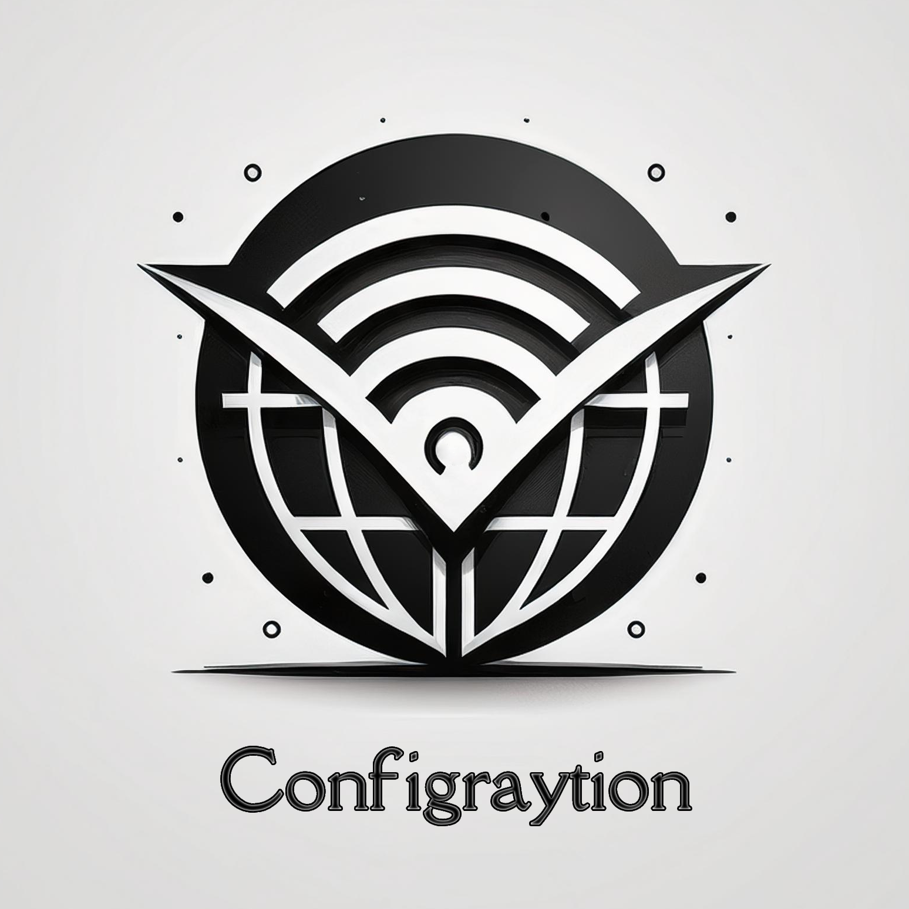

# Configraytion



Configraytion collects v2ray/xray/trojan/shadowsocks configs and facilitate access to them for everyone.

## Features

+ QR code generation
+ Validity and ping check
+ Multilanguage design
+ Access management
+ Shell scripts

## Requirements

+ Mongo DB
+ Python 3
+ Telegram account

## Installation

```
pipenv install
cp config_sample.py config.py
nano config.py
mkdir qrcode
```

## Running Receiver

Receiver module collects and processes configs.

```
pipenv shell
python receiver.py
```

## Running Publisher

Publisher module publishes configs to a Telegram channel specified in `config.py`.

```
pipenv shell
python publisher.py
```

## Running Bot

Bot module runs a Telegram bot for users to receive configs and admins to manage access.

```
pipenv shell
python bot.py
```

## Running API

API module sets up an endpoint for users to receive configs.

```
pipenv shell
fastapi run api.py
```